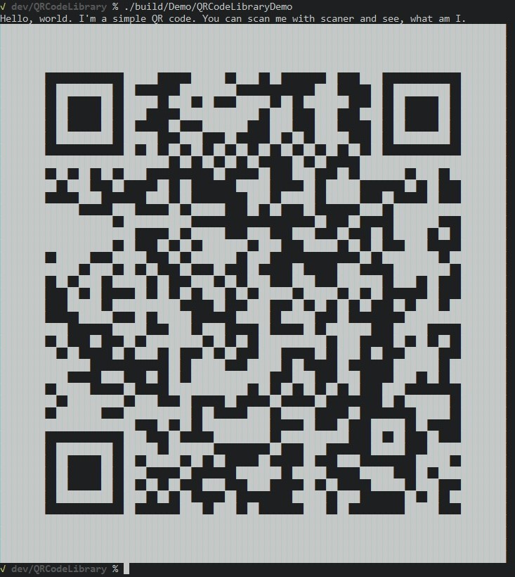

# QRCodeLibrary


<p align="center">
  
</p>

## Description

A C++ library for QRCode generation. It provides `QRCode` class with constructor, accepting input bytes as vector of unsigned chars or string and other QR code properties (see constructor definition below). After class construction you can access QR code content as new-line separated string of zeros and ones (useful for latter processing in other languages), multiline ASCII string for immidiate console output, or 2D vector of `Trit`s. It is an internal enum with three possible values: black, white or empty.

## Library interface

```c++
using byte_list = vector<unsigned char>; // shorthand for 

class QRCode
{
public:
  QRCode( const byte_list& input_, // input bytes for qr-code encoding
          CorrectionLevel corr_lvl_ = CorrectionLevel::M, // correction level of qr-code (see below for possible values)
          QRCodeMethod method_ = QRCodeMethod::Dynamic, // input encoding method (see below for possible values)
          char version_ = -1, // manual version, starting from 0 (0 - 39 versions). If not set, calculated dynamically
          unsigned char mask_n = 0 // index of mask to use (see below for different masks options)
        );
  // same as before except for input as std::string
  QRCode(const string& input_, CorrectionLevel corr_lvl_ = CorrectionLevel::M, QRCodeMethod method_ = QRCodeMethod::Dynamic, char version_ = -1, unsigned char mask_n = 0)

  string to_string() const; // presents qr-code as multiline string of zeros and ones 
  string to_ascii(char black = '#', char white = ' ', char empty = 'E') const;  // presents qr-code as multiline string of specified characters 
  vector<vector<Trit>> to_vector() const;  // presents qr-code as 2D vector of Trits 
}
```

You can increace possibility of successfull read of QR code by increacing correction level. But because of it amount of writeable data decreaces.

```c++
enum class CorrectionLevel {
  L, // low correction level -  7% of data recovery
  M, // medium               - 15%
  Q, // quarter              - 25%
  H  // high                 - 30%
};
```

```c++
enum class QRCodeMethod {
  Dynamic, // class will compute optimal encoding method
  Numeric, // only numbers allowed. Max capability: 7089 characters
  Alphabetic, // only characters from array below allowed. Max capability: 4296 characters
  Byte // sequence of any bytes allowed. Max capability: 2953 bytes
};
```

Ony the following 45 characters are available in alphabetic mode. But if you fit with them, alphabetic mode accepts twice as much characters.

```c++
{
  '0', '1', '2', '3', '4', '5', '6', '7', '8', '9',
  'A', 'B', 'C', 'D', 'E', 'F', 'G', 'H', 'I', 'J',
  'K', 'L', 'M', 'N', 'O', 'P', 'Q', 'R', 'S', 'T',
  'U', 'V', 'W', 'X', 'Y', 'Z', ' ', '$', '%', '*',
  '+', '-', '.', '/', ':'
}
```

Available QR code masks and their codes:

```c++
(row + column) % 2 == 0 // index 0
(row) % 2 == 0 // index 1
(column) % 3 == 0 // index 2
(row + column) % 3 == 0 // index 3
(floor(row / 2) + floor(column / 3)) % 2 == 0 // index 4
((row * column) % 2) + ((row * column) % 3) == 0 // index 5
(((row * column) % 2) + ((row * column) % 3)) % 2 == 0 // index 6
(((row + column) % 2) + ((row * column) % 3)) % 2 == 0 // index 7
```

You can get resulting QR code as 2D array of `Trits`:

```c++
enum Trit {
  EMPTY = -1,
  F, // White square
  T, // Black square
};
```

## Example class usage

Creating qrcode from string "HELLO WORLD" with quarter correction level, in alphabetic mode of version 2 and 3rd correction mask. Generated QR code is outputed with '#' as black and ' ' as white squares.

```c++
#include <QRCodeLibrary.hpp>

// ...

QRCode qr("HELLO WORLD", CorrectionLevel::Q, QRCodeMethod::Alphabetic, 1, 3);

std::cout << qr.to_ascii('#', ' ', 'E') << std::endl;
```

That code produces the following output:

```plain
#######   ###  ## #######
#     # #   # ##  #     #
# ### # ########  # ### #
# ### #         # # ### #
# ### #  # ###    # ### #
#     #   # # #   #     #
####### # # # # # #######
          # ###          
 ### ##   ## ## #     ## 
### #  # ####  ## ### # #
## # ##  # ## ## #   # ##
 #   #   ### ### #  # ###
 # ## #   ##    # #    ##
    ## ###          ##  #
 ## # #     ##   ### #  #
#   ##  #  ### #   # #  #
  # ### #  ## # ##### ## 
        ### # # #   ## ##
#######   ###  ## # #    
#     # ## # # ##   ###  
# ### #    # # ###### ## 
# ### # # # ###### ##   #
# ### # ## #   ###  #  # 
#     # ##     ##  # #  #
#######  ## # ## ###    #
```

## Building instructions

You can build library by using either cmake or Visual Studio 2019.

For cmake:

```bash
git clone https://github.com/dm1sh/QRCodeLibrary
cd QRCodeLibrary

cmake -Bbuild -DCMAKE_BUILD_TYPE=Release -H.
cmake --build build --target QRCodeLibrary
cd QRCodeLibrary && sudo cmake --install build
```

For Visual Studio 2019:

Open `QRCodeLibrary.sln` file. This is the root solution file of this library with demo project and tests set up. For Visual Stuio instructions, refer to [official docs](https://visualstudio.microsoft.com/vs/getting-started). Later instructions will show how to build this repository with CMake.

## Testing

To test library, clone repository like in the previous code block and in its folder run the following commands:

```bash
cmake --build build --target testQRCode
cd build && ctest --rerun-failed --output-on-failure
```

That will run automatic GTest unit tests and display its results.

## Demo application

There is also an MVP demo application, working with that library. It gets user input until EOF and produces beautiful square QR code from that. This application is crossplatform. Tested to work on Linux and Windows 10 environment. It must also work on Mac as well. Below you can see build and run instructions as well as example input and output.

### Build and run

```bash
cmake --build build --target QRCodeLibraryDemo
./build/Demo/QRCodeLibraryDemo
```

### Example input and output

<details>
  <summary>Input</summary>

```plain
Hello, world. I'm a simple QR code. You can scan me with scaner and see, what am I.
```

</details>

<details>
  <summary>Output</summary>

```
██████████████████████████████████████████████████████████████████████████████████████████
██████████████████████████████████████████████████████████████████████████████████████████
██████████████████████████████████████████████████████████████████████████████████████████
██████████████████████████████████████████████████████████████████████████████████████████
████████              ██████      ██████  ████  ██        ██    ████              ████████
████████  ██████████  ██        ██████████              ████      ██  ██████████  ████████
████████  ██      ██  ██████  ████  ██    ██████  ██  ████████    ██  ██      ██  ████████
████████  ██      ██  ████      ██████████████  ████    ████    ████  ██      ██  ████████
████████  ██      ██  ██      ██    ████████    ████    ████      ██  ██      ██  ████████
████████  ██████████  ██████    ████    ██      ██  ██  ██████    ██  ██████████  ████████
████████              ██  ██  ██  ██  ██  ██  ██  ██  ██  ██  ██  ██              ████████
██████████████████████████████  ██  ██  ██  ██      ██  ██      ██████████████████████████
████████  ██  ██  ██  ████            ██      ██    ████    ██  ████████  ████  ██████████
██████████  ████    ██      ██  ██        ██████      ██  ██████        ██  ██    ████████
████████      ████        ████  ██          ████  ██████  ██████    ██      ██    ████████
██████████████      ████      ██  ██████    ██  ██    ██        ████  ████████████████████
████████████████████  ████████████                      ██    ██      ████████    ████████
████████████████████████      ██  ██████    ████    ████    ██    ██  ██████  ██  ████████
████████████████████  ██    ██  ██  ████████  ████    ██████  ██  ██    ████      ████████
████████  ██████    ██████    ██  ████████  ████                ██  ██████████  ██████████
██████████████  ████  ██  ██    ██    ██    ██      ██      ████      ██████████  ████████
████████  ██  ████  ██████  ██    ████  ██  ████    ████    ████████  ████  ██    ████████
████████    ██  ██      ██  ██  ██  ████  ██  ██████  ██████  ██  ██        ██    ████████
████████    ██████  ████████████      ██    ████    ██  ██  ██  ██    ██  ████  ██████████
████████      ██████    ██  ██████        ██████  ██████    ██          ██████████████████
████████████        ██████    ████  ████      ██      ██  ████████    ██████      ████████
████████  ██    ██    ██  ██████████  ██  ██  ████████████  ████      ██  ██  ██  ████████
██████████  ██      ██  ████  ██    ██  ██    ████      ██  ████  ██    ██████    ████████
████████████████              ██  ██████    ██████  ██      ██        ████████  ██████████
████████████      ████    ██  ██  ██████████████    ████    ████      ████  ██  ██████████
████████  ██████      ██      ██████████████  ██  ██  ██  ██  ██    ████          ████████
██████████  ██████████  ████    ██      ██      ██      ██          ██  ████████  ████████
████████  ████████    ████████████  ██      ████  ██████      ██          ██████  ████████
████████████████████████    ██  ██  ████████████      ██    ██    ██████  ██      ████████
████████              ████    ██      ██████████  ████████████    ██  ██    ██    ████████
████████  ██████████  ██████  ████████          ██    ████        ██████    ██████████████
████████  ██      ██  ██  ██████  ██  ██      ██      ██    ████          ██████  ████████
████████  ██      ██  ████      ██        ████████  ██████      ██████    ██  ████████████
████████  ██      ██  ██  ██  ██    ████    ████      ██  ██      ██████  ████    ████████
████████  ██████████  ████  ██  ██      ██          ██████  ████        ██  ██  ██████████
████████              ██        ████  ████  ██        ████  ██          ██████    ████████
██████████████████████████████████████████████████████████████████████████████████████████
██████████████████████████████████████████████████████████████████████████████████████████
██████████████████████████████████████████████████████████████████████████████████████████
██████████████████████████████████████████████████████████████████████████████████████████
```

</details>


